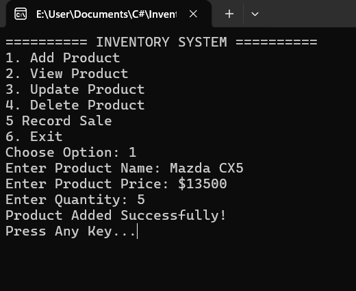
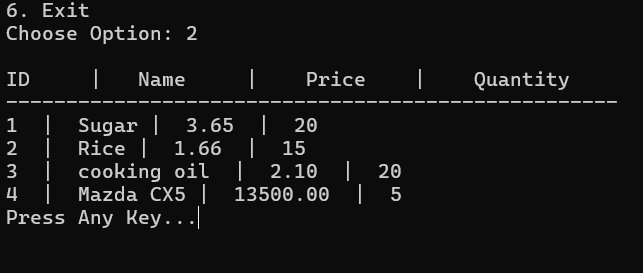
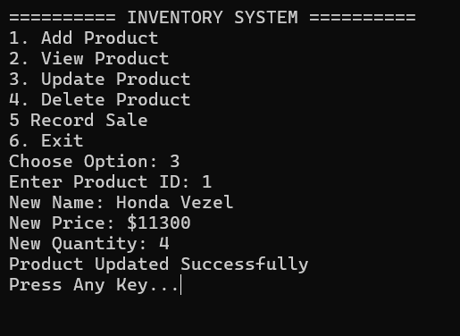
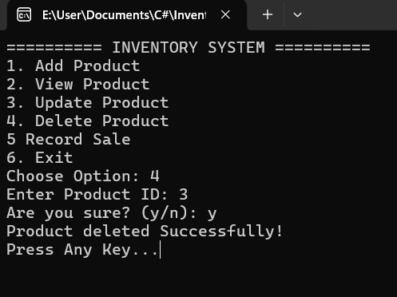
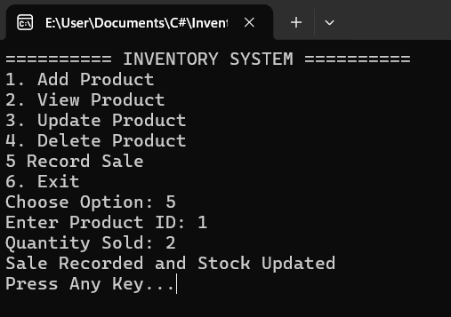

### **Inventory Management System** 

**Description**

A console based inventory system built with C# and SQL Server that manages products and sales with real-time stock updates.

**Features**

* Add Product
* View Products
* Update Product
* Delete Product
* Record Sales
* Automatic Stock Deduction
* Input validation and error handling

**Business Logic**

* Prevents selling more than available stock
* Updates inventory after each sale
* Maintains product-sales relationship

**Technologies Used**

* C#
* SQL Server
* ADO.NET

**How to run**

* Open in Visual Studio 
* Update connection String
* Run the program

**Screenshots**

**Author**

TINOTENDA MUGURUNGI 

